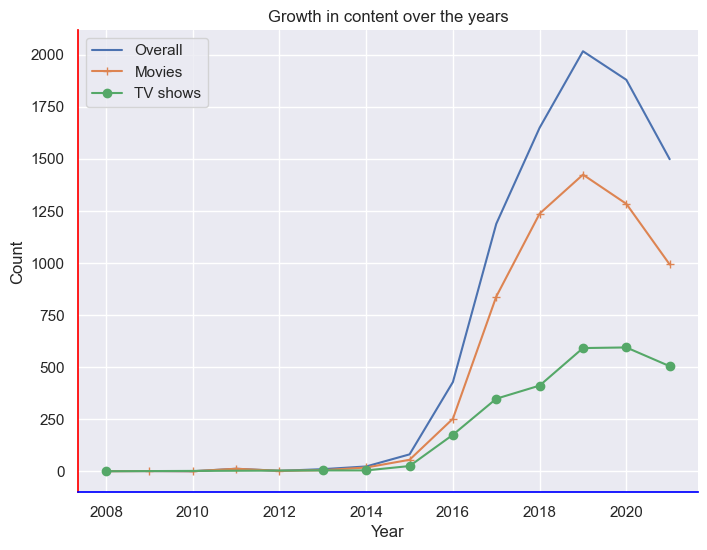
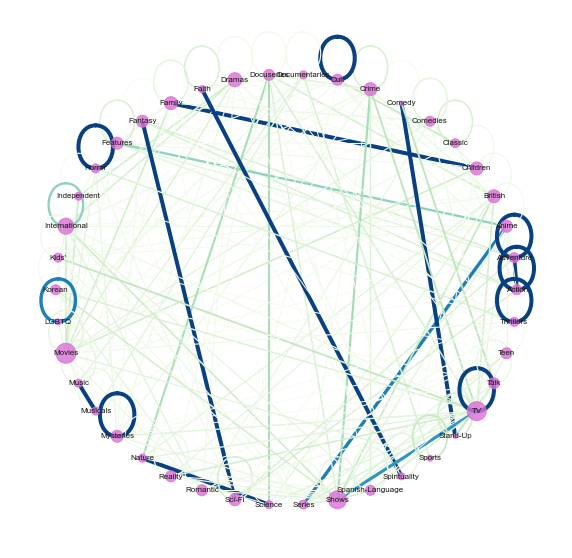
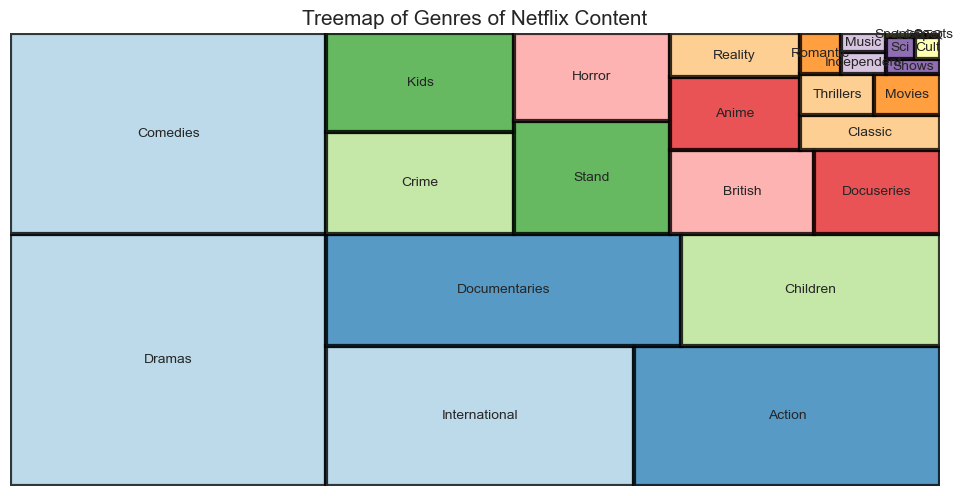
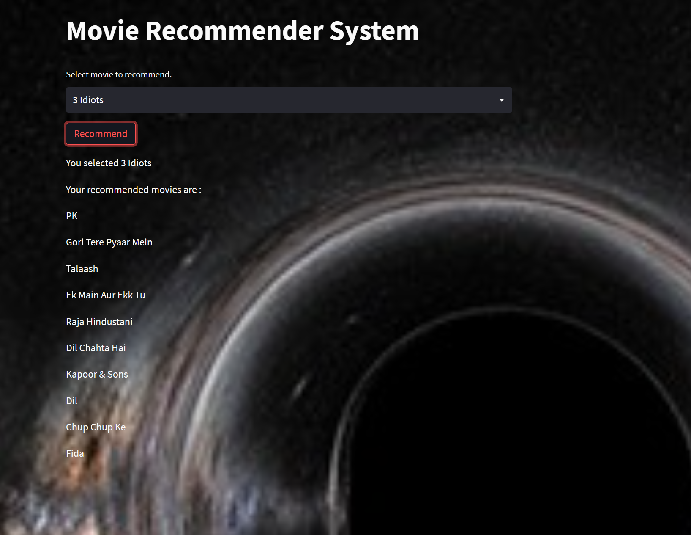

RecLix
==============================
<!-- PROJECT LOGO -->
<br />
<div align="center">
  <a>
    
  </a>
</div>

Recommends movie titles based on other movie titles.

This project delves into the realm of Exploratory Data Analysis, using the Cosine similarity metric to identify and recommend movies that are semantically similar based on their vectorized bag-of-words representation.

Project Organization
------------

    ├── LICENSE
    ├── Makefile           <- Makefile with commands like `make data` or `make train`
    ├── README.md          <- The top-level README for developers using this project.
	├── readme-assets      <- Contains images to be used in README.md
    ├── data
    │   └── raw            <- The original, immutable data dump.
    │
    ├── docs               <- A default Sphinx project; see sphinx-doc.org for details
    │
    ├── models             <- Trained and serialized models, model predictions, or model summaries
    │
    ├── notebooks          <- Jupyter notebooks for downloading dataset, carrying out EDA and building recommendation system
    │
    ├── reports            <- Generated analysis as PDF.
    │   └── figures        <- Generated graphics and figures to be used in reporting
	├── static             <- images for streamlit app
	├── app.py             <- StreamLit app for hosting on local browser
	├── requirements.txt   <- The requirements file for reproducing the analysis environment, e.g.
    │                         generated with `pip freeze > requirements.txt`
    └── .env               <- vscode environment configurations for the project


--------

Prerequisites
------------
Before you begin, ensure you have met the following requirements:
* You have a `Linux/Mac/Windows` machine.
* You have installed a `python` distribution.
* You have installed `pip`.
* You have installed `make`.

Usage
------------
1. Clone the repo
	```
	git clone https://github.com/chauhan-vivek/RecLix.git
	```
2. Create virtual environment.
	```make
	make create_environment
	```
3. Activate virtual environment.
4. Download and install all required packages.
	```make
	make requirements
	```
5. Download data from Kaggle using Kaggle API:   
	(All steps performed in Notebook, exclude "!" if running on CLI.)
	<br />
	Step 1 : pip install kaggle <br />
	step 2 : Create an account on Kaggle. In accounts click on Create API. This downloads kaggle.json which should be placed in ~/.kaggle <br />
	Step 3 : Search the dataset of interest <br />
	Step 4 : Download dataset to mentioned path. <br />
	Step 5: Unzip the file either using zipfile module from python or using bash CLI tar command <br />
	<br />
	```make
	!pip install kaggle
	!mkdir -p ~/.kaggle
	!cp kaggle.json ~/.kaggle/
	!ls ~/.kaggle
	!chmod 600 /root/.kaggle/kaggle.json  # set permission
	!kaggle datasets list -s Netflix Movies and TV Shows
	'!kaggle datasets download shivamb/netflix-shows -f netflix_titles.csv -p C:\Users\hp\Desktop\rec-flix\data\raw'
	!tar -xvf #extract files
	!tar -cvf #creates zip files
	```
6. Run EDA

7. Generate vectorized bag of words representation and make recommendations

8. Run Streamlit app.
	```make
	'streamlit run c:/Users/hp/Desktop/rec-flix/app.py'
	```


Outputs
------------
EDA and Streamlit app

EDA:

<div align="center">
  <a>
    
  </a>
</div>

<div align="center">
  <a>
    
  </a>
</div>

<div align="center">
  <a>
    
  </a>
</div>


StramLit App:

<div align="center">
  <a>
    
  </a>
</div>

<div align="center">
  <a>
    
  </a>
</div>

Ackowledgements
------------
* [drivendata](https://github.com/drivendata)
* [Shivam Bansal](https://www.kaggle.com/datasets/shivamb/netflix-shows)
--------
